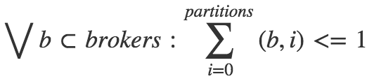

Kafka Partitions Assignment Optimizer
====

If you have more than 4 brokers spread on several top-of-rack switches (_TOR_)
or availability zones (_AZ_), you might be interested in balancing replicas
and leaders properly to survive to a switch failure and to avoid bottlenecks.

In addition to that, when you're re-assigning replicas because of broker failure,
or changing the topology (server(s) addition) or the replication factor,
you might be interested in minimizing the number of partitions to move
to avoid killing your network.

For this latter, the `kafka-reassign-partitions.sh` utility provided with Kafka
is not doing a perfect job at minimizing the number of replicas moves.

To give a concrete example, adding or removing a server from the cluster is
generating lots of replica moves (i.e. network traffic) that might impact the
overall cluster performance.

Last but not least, if you're running a version of Kafka which does not include
[KIP-36 (rack aware replica assignment)](https://cwiki.apache.org/confluence/display/KAFKA/KIP-36+Rack+aware+replica+assignment)
you don't have any knowledge about the network topology in the
assignment algorithm.

## Demonstration: `kafka-reassign-partitions.sh` under-efficiency

Lets assume we have a cluster with 20 brokers, named 0-19, spread across 2 AZ.
Brokers with odd numbers are all on the same _AZ_ `b`,
brokers with even numbers are wired to `a`.

We have a topic `x.y.z.t` with 10 partitions and a replication factor of 2.

Lets run `kafka-reassign-partitions` and see what's happening.

1. Generate a file `topics-to-move.json` with the topic
```
{
  "topics": [{"topic": "x.y.z.t"}],
  "version": 1
}
```

2. Call `kafka-reassign-partitions` trying to remove broker `19`

```
$ kafka-reassign-partitions --zookeeper $ZK --generate \
    --topics-to-move-json-file topics-to-move.json \
    --broker-list 0,1,2,3,4,5,6,7,8,9,10,11,12,13,14,15,16,17,18

Current partition replica assignment

{"version":1,"partitions":[
    {"topic":"x.y.z.t","partition":0,"replicas":[7,18]},
    {"topic":"x.y.z.t","partition":1,"replicas":[8,19]},
    {"topic":"x.y.z.t","partition":2,"replicas":[9,10]},
    {"topic":"x.y.z.t","partition":3,"replicas":[0,11]},
    {"topic":"x.y.z.t","partition":4,"replicas":[1,12]},
    {"topic":"x.y.z.t","partition":5,"replicas":[2,13]},
    {"topic":"x.y.z.t","partition":6,"replicas":[3,14]},
    {"topic":"x.y.z.t","partition":7,"replicas":[4,15]},
    {"topic":"x.y.z.t","partition":8,"replicas":[5,16]},
    {"topic":"x.y.z.t","partition":9,"replicas":[6,17]}
]}

Proposed partition reassignment configuration

{"version":1,"partitions":[
    {"topic":"x.y.z.t","partition":0,"replicas":[14,17]},
    {"topic":"x.y.z.t","partition":1,"replicas":[15,18]},
    {"topic":"x.y.z.t","partition":2,"replicas":[16,0]},
    {"topic":"x.y.z.t","partition":3,"replicas":[17,1]},
    {"topic":"x.y.z.t","partition":4,"replicas":[18,2]},
    {"topic":"x.y.z.t","partition":5,"replicas":[0,3]},
    {"topic":"x.y.z.t","partition":6,"replicas":[1,4]},
    {"topic":"x.y.z.t","partition":7,"replicas":[2,5]},
    {"topic":"x.y.z.t","partition":8,"replicas":[3,6]},
    {"topic":"x.y.z.t","partition":9,"replicas":[4,7]}
]}
```

_(I did just re-format and sort the json output for sake of clarity)._

If you compare partition by partition, you can see a **lot** of changes in the partition assignment.
That's rather unfortunate, since computing the diff manually,
we could simply change the assignment of partition `1`, like:

```
{"topic":"x.y.z.t","partition":1,"replicas":[8,1]},
```

All the other moves are not required.

Of course `kafka-reassign-partitions` is only proposing an example reassignment
configuration and editing manually might appear easy,
but when you're dealing with bigger topics with 40 or more partitions 
and you're under fire, you'd probably like to have a tool
on which you can rely to do that right without too many manual edits.

LinkedIn open-sourced its [kafka-tools](https://github.com/linkedin/kafka-tools)
which has really nice features for day to day operations, but lots of 
`random.shuffle(replicas)` are used internally, which might end-up in
sub-optimal placements. The tool don't have rack awareness either at the time 
of writing.


# Replica assignment as a constraint satisfaction problem

If you think out of the box, replicas assignments looks like an 
[constraint satisfaction problem](https://en.wikipedia.org/wiki/Constraint_satisfaction_problem).

For instance, "no two replicas of the same partition assigned to the same broker" is one of
these constraints which could be expressed as an equation, opening the door
to [mathematical optimization](https://en.wikipedia.org/wiki/Mathematical_optimization)
to find the optimum.

## Minimize the number of replicas to move

To minimize the move of replicas, the idea is to assign more weight (i.e. more value)
to existing assignments, so that the linear optimization will try to preserve
existing assignment (and in turn minimising the number of bytes moved across the brokers).

Let's define a variable as a concatenation of broker id and partition id, such as
`b9_p6`. This variable will be 1 if the partition 6 is assigned to the broker 9,
0 otherwise.

The previous constraint, "no two replicas of the same partition assigned to the same broker",
would be expressed as 



Now you got the trick, there are (almost) no limits on constraints to add. The current implementation
includes for instance _leader preservation_, i.e. the preferred leader has more weight
than the other partitions.

[lp_solve](http://lpsolve.sourceforge.net/5.5/) is used behind the scene
to solve the generated linear equation.


## Example of equation

Here is an example of equations generated based on the current assignment and the list of
brokers.

```
// Optimization function, based on current assignment 
max: 1 t1b12p5 + 4 t1b19p6_l + 2 t1b14p8 + 2 t1b11p2_l + 1 t1b21p2 ...

// Constrain on replication factor for every partition
t1b1p0 + ... + t1b19p0_l + ... + t1b32p0_l = 2;
t1b1p1 + ... + t1b19p1_l + ... + t1b32p1_l = 2;
...

// Constraint on having one and only one leader per partition
t1b1p0_l + ... + t1b19p0_l + ... + t1b32p0_l = 1;
t1b1p1_l + ... + t1b19p1_l + ... + t1b32p1_l = 1;
...

// Constraint on min/max replicas per broker
t1b1p0 + t1b1p0_l + ... + t1b1p9 + t1b1p9_l <= 2;
t1b1p0 + t1b1p0_l + ... + t1b1p9 + t1b1p9_l >= 1;
...

// Constraint on min/max leaders per broker
t1b1p0_l + t1b1p1_l + ... + t1b1p8_l + t1b1p9_l <= 1;
t1b2p0_l + t1b2p1_l + ... + t1b2p8_l + t1b2p9_l >= 0;
...

// Constraint on no leader and replicas on the same broker
t1b1p0 + t1b1p0_l <= 1;
t1b1p1 + t1b1p1_l <= 1;
...

// Constrain on min/max total replicas per racks. tor02 here
t1b2p0 + t1b2p0_l + ... t1b30p9 + t1b30p9_l <= 10;
t1b2p0 + t1b2p0_l + ... t1b30p9 + t1b30p9_l >= 10;
...

// Constrain on min/max replicas per partitions per racks. p0 on tor02 here
t1b2p0 + t1b2p0_l + ... + t1b30p0 + t1b30p0_l <= 1;
...

// All variables are binary
bin
t1b1p0, t1b1p0_l, ... , t1b32p9, t1b32p9_l;
```

# Real World Usage

One public instance of Kafka Partitions Assignment Optimizer is hosted with ❤ by [Sqooba](http://sqooba.io).

See [https://kafka-optimizer.sqooba.io/](https://kafka-optimizer.sqooba.io/)
for an extended example.

API endpoint: **https://kafka-optimizer.sqooba.io/submit**


# Greetings

* [http://www.hostmath.com/](http://www.hostmath.com/) for the equation graphics
* [Lp_solve](http://lpsolve.sourceforge.net/5.5/) for the great open-source solver
* [DAPLAB](http://daplab.ch) for hosting a public version of the optimizer.
